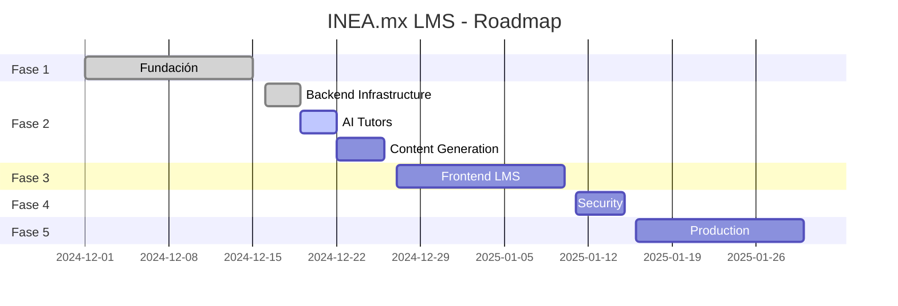
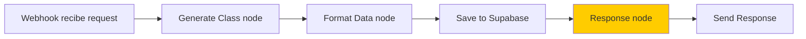
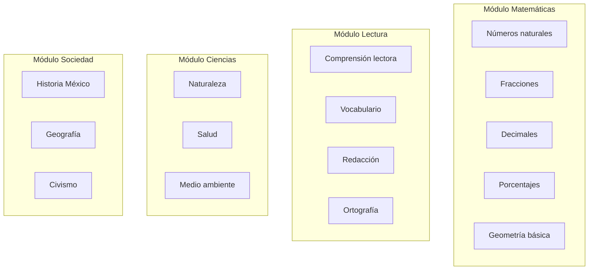
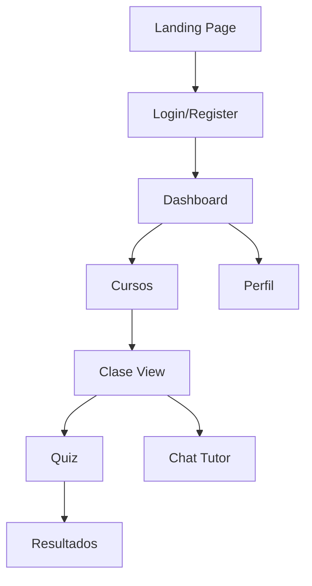

# 🚀 Plan de Implementación - INEA.mx LMS (Ultra Proyecto)
> **Actualizado:** 19 Diciembre 2025  
> **Fase Actual:** 2B - AI Tutors Funcionales

---

## 📊 Estado General del Proyecto



---

## ✅ Fase 1: Fundación (COMPLETADA)

| Componente | Estado | Detalles |
|------------|--------|----------|
| **Infraestructura 3-VPS** | ✅ | Support (216.238.70.204), Main (64.177.81.23), Mirror |
| **VPS Manager Panel** | ✅ | Next.js en `http://216.238.70.204:3005` |
| **n8n Automation** | ✅ | 4 workflows activos |
| **Directus CMS** | ✅ | Backend en VPS Main con PostgreSQL + Redis |
| **Alta Disponibilidad** | ✅ | VPS Mirror clonado y funcional |
| **GitHub Repo** | ✅ | BuilderAdmin consolidado |

---

## ✅ Fase 2A: Backend Infrastructure (COMPLETADA)

### Supabase Instalado y Configurado

| Componente | Estado | URL/Detalles |
|------------|--------|--------------|
| Studio GUI | ✅ | `http://64.177.81.23:3001` |
| REST API | ✅ | `http://64.177.81.23:8000` |
| PostgreSQL | ✅ | Puerto 5432, RLS disabled |
| Tabla clases_generadas | ✅ | 5 columnas, permisos OK |

### n8n Workflows Configurados

| Workflow | Estado | Webhook |
|----------|--------|---------|
| INEA Class Generator - SambaNova | ✅ | `/webhook/inea-class-sambanova` |
| INEA Class Generator v2 | ✅ | `/webhook/inea-generate-class` |
| INEA Class + Supabase Storage | ✅ | `/webhook/inea-class-to-supabase` |
| INEA Class + Supabase V2 | ✅ | `/webhook/clase-supabase` |

### Credenciales Documentadas

- ✅ VPS SSH access (3 servidores)
- ✅ Dokploy SSH keys (ED25519 + RSA)
- ✅ API Keys (Gemini, SambaNova, Groq, OpenRouter)
- ✅ Supabase keys (ANON, SERVICE_ROLE)
- ✅ n8n API Key (expires Jan 2026)

---

## 🔄 Fase 2B: AI Tutors Funcionales (EN PROGRESO - 75%)

### Completado
- ✅ SambaNova Llama 3.3 70B probado y funcionando
- ✅ Workflows de generación de clases creados
- ✅ Integración con Supabase configurada
- ✅ SERVICE_ROLE_KEY en workflows

### Pendiente

#### 2B.1 Debugging Webhook Response (1-2 horas)



**Tareas:**
- [ ] Abrir n8n UI (`http://216.238.70.204:5678`)
- [ ] Ejecutar workflow manualmente con test data
- [ ] Verificar output de cada nodo
- [ ] Ajustar Response node para devolver JSON correcto
- [ ] Probar con curl/Postman

#### 2B.2 Chat Tutor Endpoint (4-6 horas)

**Crear:** `/api/tutor/chat`

```javascript
// Estructura esperada
POST /api/tutor/chat
{
  "message": "¿Cómo sumo fracciones?",
  "lesson_context": "fracciones_basicas",
  "student_id": "uuid"
}

// Response (<500ms via Groq)
{
  "response": "Para sumar fracciones...",
  "tokens_used": 150,
  "model": "llama-3.2-90b-text-preview"
}
```

---

## 📚 Fase 2C: Generación de Contenido Educativo (3-5 días)

### Objetivo
Crear biblioteca completa de clases para el programa INEA México.

### Estructura de Contenido



### Tareas

1. **Template de Clase (JSON Schema)**
   - [ ] Definir estructura estándar
   - [ ] Incluir: título, objetivos, contenido, ejemplos, quiz
   - [ ] Campos para multimedia (placeholder)

2. **Generación Masiva**
   - [ ] Crear script para generar 20+ clases
   - [ ] Usar workflow n8n + Supabase
   - [ ] Revisar calidad de contenido

3. **Organización en Base de Datos**
   - [ ] Crear tabla `modulos` (categorías)
   - [ ] Crear tabla `estudiantes_progreso`
   - [ ] Relacionar clases con módulos

---

## 🖥️ Fase 3: Frontend LMS para Estudiantes (1-2 semanas)

### Stack Tecnológico

| Componente | Tecnología |
|------------|------------|
| Framework | Next.js 15 (App Router) |
| Estilos | Tailwind CSS + Shadcn/UI |
| Backend | Supabase (Auth + DB + Storage) |
| Chat IA | WebSocket + Groq API |
| Hosting | VPS Main (Docker) |

### Páginas a Desarrollar



| Página | Prioridad | Complejidad | Funcionalidades |
|--------|-----------|-------------|-----------------|
| Landing | 🔴 Alta | Baja | Hero, Features, CTA |
| Login/Register | 🔴 Alta | Media | Supabase Auth |
| Dashboard | 🔴 Alta | Media | Cursos, Progreso |
| Clase View | 🔴 Alta | Alta | Contenido, Quiz, Chat |
| Chat Tutor | 🟠 Media | Alta | WebSocket, Contexto |
| Perfil | 🟡 Baja | Baja | Datos, Certificados |

### Diseño UI/UX

- **Tema:** Oscuro moderno, accesible
- **Colores:** Azul INEA (#003366), acentos verdes
- **Tipografía:** Inter, Roboto
- **Animaciones:** Micro-interacciones sutiles

---

## 🔐 Fase 4: Seguridad y Estabilidad (3-5 días)

### Tareas

1. **Autenticación VPS Panel**
   - [ ] Implementar NextAuth
   - [ ] Login con credenciales Directus
   - [ ] Middleware de protección

2. **Backups Automáticos**
   - [ ] Cron job diario (3 AM)
   - [ ] Retención: 7 días rolling
   - [ ] Notificación por n8n si falla

3. **HTTPS**
   - [ ] Let's Encrypt via Traefik
   - [ ] Certificados auto-renovables
   - [ ] Redirección HTTP → HTTPS

4. **Rate Limiting**
   - [ ] Limitar requests por IP
   - [ ] Proteger endpoints sensibles
   - [ ] Logs de intentos sospechosos

---

## 🚀 Fase 5: Producción (2-3 semanas)

### Infraestructura

- [ ] Dominio personalizado (aprendeinea.mx)
- [ ] SSL/TLS en todos los servicios
- [ ] CDN para assets estáticos (Cloudflare)
- [ ] Load balancer entre Main y Mirror

### Monitoreo

- [ ] Grafana + Prometheus
- [ ] Alertas por correo/Telegram
- [ ] Dashboard de métricas
- [ ] Logs centralizados

### CI/CD

- [ ] GitHub Actions para deploy automático
- [ ] Tests antes de merge
- [ ] Rollback automático si falla

### Documentación

- [ ] Manual de usuario (estudiantes)
- [ ] Manual de administrador
- [ ] API documentation (Swagger)

---

## 📞 Recursos del Sistema

| Recurso | URL |
|---------|-----|
| VPS Panel | http://216.238.70.204:3005 |
| n8n Workflows | http://216.238.70.204:5678 |
| Supabase Studio | http://64.177.81.23:3001 |
| Supabase API | http://64.177.81.23:8000 |
| Directus Admin | http://64.177.81.23:8055 |
| GitHub Repo | github.com/aprendeineamx-max/BuilderAdmin |
| Credenciales | secrets.md (local) |

---

## 🔧 Decisiones Técnicas

| Decisión | Elegido | Alternativa | Razón |
|----------|---------|-------------|-------|
| IA para clases | SambaNova | Gemini | Mejor calidad en español |
| Chat tiempo real | Groq | OpenAI | Velocidad (<500ms) |
| Base de datos | Supabase | Directus | REST API + Auth integrado |
| Frontend | Next.js | React | SSR + App Router |
| Estilos | Tailwind | CSS Modules | Desarrollo rápido |

---

> **Nota:** Trabajo ejecutado desde Antigravity. Código en BuilderAdmin.
> Credenciales sensibles en secrets.md (no en repo público).
